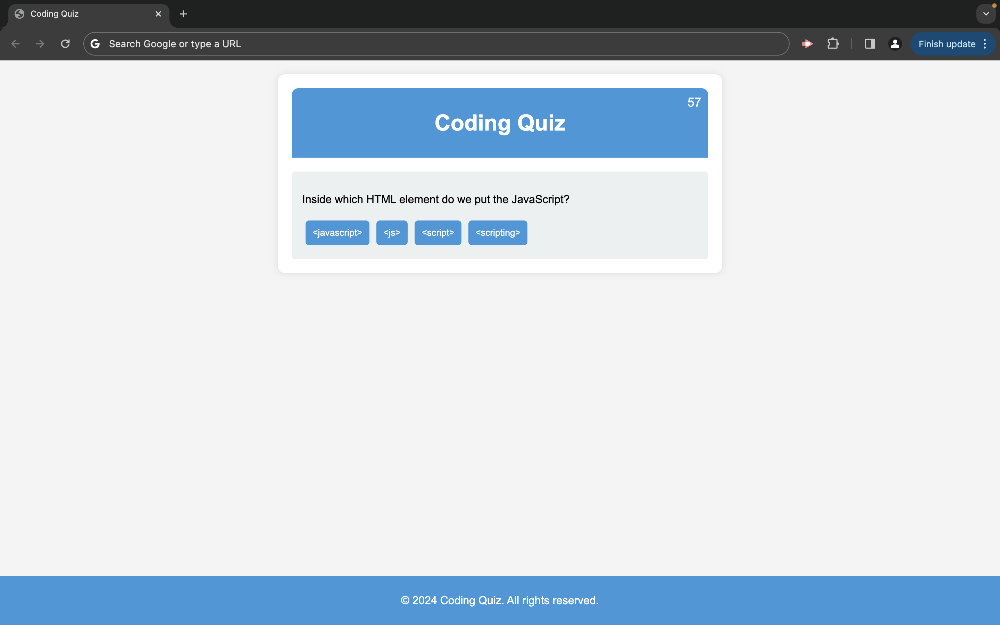

# Coding Quiz

This is a simple coding quiz web application built using HTML, CSS, and JavaScript.

## Description

The project consists of the following files:
- `index.html`: Contains the HTML structure of the web page.
- `styles.css`: Contains the CSS styling for the web page.
- `script.js`: Contains the JavaScript code for the quiz functionality.

## Features

- Start quiz button to begin the quiz.
- Timer display to show the remaining time for the quiz.
- Questions with multiple-choice options.
- Feedback for correct and incorrect answers.
- Score tracking.
- High scores display.
- Ability to restart the quiz.

## Credits

This project was created by Mandeep Singh.

## License

This project is licensed under the [MIT License](LICENSE).

## Copyright

&copy; 2024 Mandeep Singh.

https://mandeepiscoding.github.io/timed-coding-quiz/
